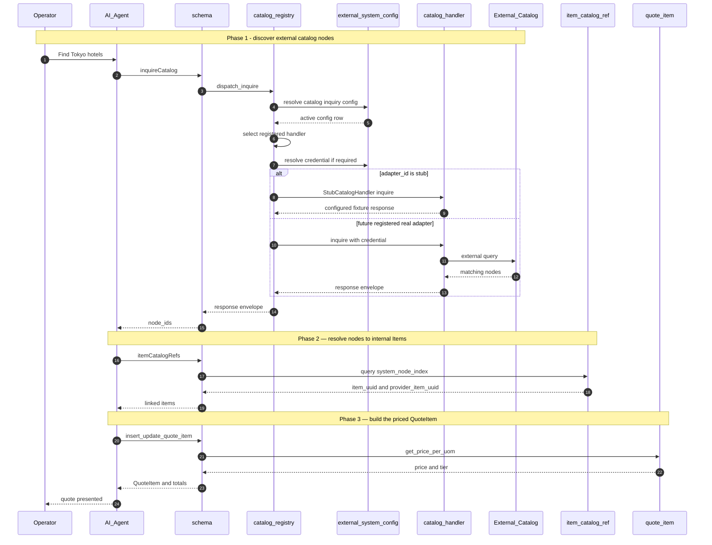
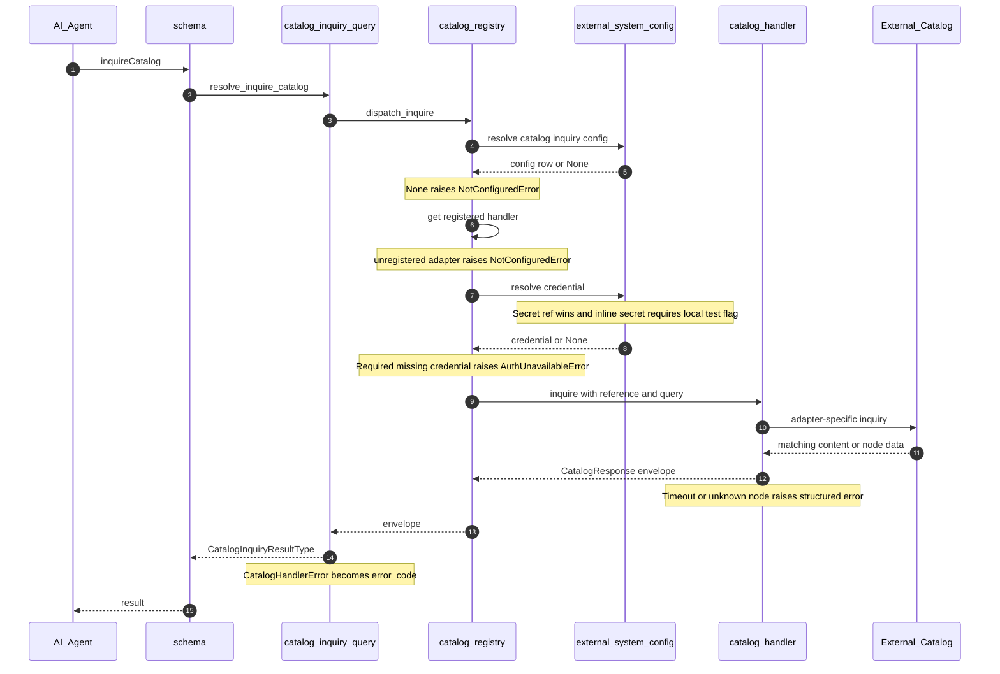
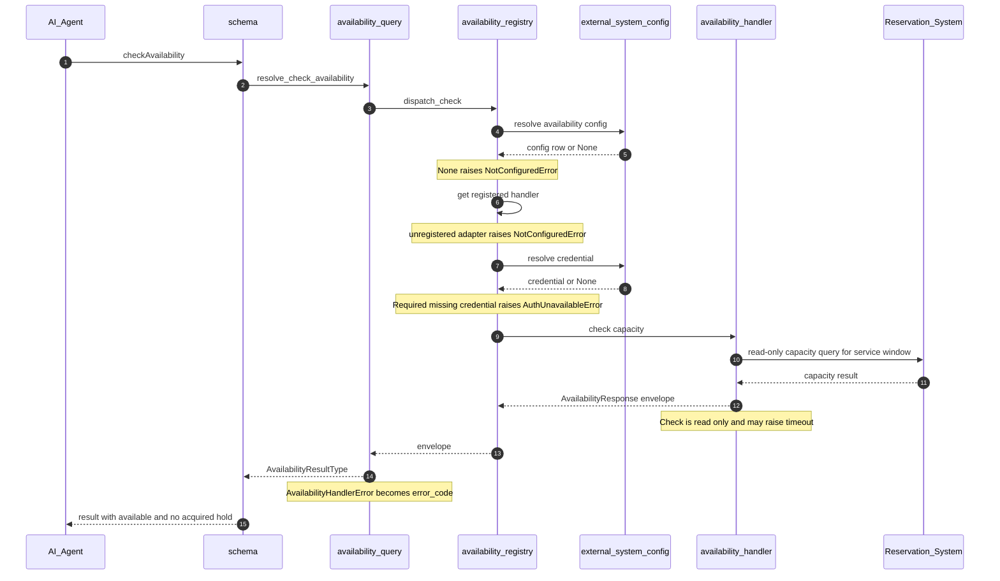

# AI RFQ Engine → Hospitality Business: Gap Closure Plan

> **Status**: Revised draft, aligned to current `ai_rfq_engine` source | **Last Updated**: 2026-05-23
>
> **Related docs**: [DEVELOPMENT_PLAN.md](DEVELOPMENT_PLAN.md) · [PRICING_CALCULATION.md](PRICING_CALCULATION.md) · [DISCOUNT_PROMOTION_PROMPT.md](DISCOUNT_PROMOTION_PROMPT.md)
>
> **Implementation baseline**: the Python models, GraphQL schema, and tests in this repository. Any MCP processor, email-delivery, payment, PMS, or GDS capability is an external dependency until confirmed in its own repository.

---

## 0. Recommended Architecture: Single Core, Integration Boundaries Outside It

Hospitality-specific commercial fields and quote-calculation behavior should be implemented in **`ai_rfq_engine` core**, rather than introducing a separate `ai_hospitality_engine` module. External availability, catalog inquiry, payment, fulfillment, and customer-notification systems remain integrations; whether live-inventory and catalog-inquiry adapters live inside this repository or in a separately deployed integration service is an ADR decision. Rationale:

- **The core already owns the relevant records**: `Item`, `ProviderItem`, `ProviderItemBatch`, `ItemPriceTier`, `Request`, `Quote`, `QuoteItem`, and `Installment`.
- **Pricing and quote-total logic is centralized** in [models/quote_item.py](../ai_rfq_engine/models/quote_item.py) and [models/quote.py](../ai_rfq_engine/models/quote.py). Guest-mix or bundle calculations should not be duplicated in a separate product module.
- **Integration concerns remain separable**: live inventory adapters and payment or notification actions should be invoked through explicit contracts and should not be modeled as DynamoDB truth.

This is a proposed architecture decision. Confirm it in an ADR before Phase 1 changes are implemented.

---

## 1. Purpose

The AI RFQ Engine was built for B2B procurement: catalog items, suppliers, batch costs, and quote workflows. Hospitality workloads reuse most of that workflow, but add service-date capacity, guest composition, time-sensitive availability, packaging, customer-facing terms, and potentially multiple currencies.

This document inventories those gaps against the current source tree and sequences the work to close them.

**In scope**: model, GraphQL API, pricing, quote-total, persistence, and test changes within the `ai_rfq_engine` core; definitions of integration contracts required by a consuming application.  
**Out of scope**: payment-gateway implementation, vendor adapters beyond the explicitly selected pilot adapter, catalog-graph schemas, email or document generation, and changes in external MCP repositories.

### 1.1 Hospitality verticals the engine should serve

| Vertical | Example product | Example provider |
|---|---|---|
| Lodging | Hotel night, vacation rental, B&B room | Hotel chain, independent property, OTA |
| Food & beverage | Restaurant table, banquet, group dining | Restaurant, banquet venue, caterer |
| Events & venues | Conference seat, wedding hall booking, AV package | Convention center, wedding venue, MICE planner |
| Cruise & charter | Cabin night, shore excursion, charter day | Cruise line, charter operator |
| Attractions | Theme-park ticket, museum admission, spa session | Park operator, museum, wellness center |
| Tours & activities | Day tour, class, guided experience | DMC, activity operator, instructor |
| Travel agency | Multi-leg itinerary (flight + hotel + transfer) | OTA, traditional agent, tour operator |
| Transportation | Transfer, rental, charter | Limo company, rental fleet, transport DMC |

A common quote model should support these cases without assuming that lodging, admission, restaurant capacity, and transport share identical pricing rules. The seven gaps below are the minimum capability areas to validate.

---

## 2. Current Fit Summary

### 2.1 What works as-is (no change required)

| RFQ Engine Concept | Hospitality Use | Notes |
|---|---|---|
| `Item` | Generic sellable product (room type, table package, cabin, ticket, slot) | Existing `item_type` and `item_external_id` can identify pilot products |
| `ProviderItem` | A supplier's specific offering | `provider_corp_external_id` maps to property code, venue code, or operator code |
| `Segment` + `SegmentContact` | Customer segments (retail, corporate, loyalty tier, OTA channel, agent-of-record) | Email-based segment lookup already implemented |
| `Request` / `Quote` / `QuoteItem` | Inquiry -> priced offer | `QuoteItem` calculates tier-based pricing; `Quote` totals are recalculated from quote items |
| `Installment` | Deposit + balance schedule | Installments are associated with a `Quote`, not an individual `QuoteItem` |
| `File` | Request-associated file metadata | Current model stores `file_name`, uploader email, and timestamps; content/storage delivery is not modeled here |
| `DiscountPrompt` | Promotions, loyalty discounts, channel overrides, agent commissions | GLOBAL / SEGMENT / ITEM / PROVIDER_ITEM scopes cover hospitality discounting patterns |
| GraphQL queries and mutations | Core API surface for a pilot | MCP/tool wrappers are external to this repository and must be confirmed separately |

### 2.2 What needs work

Seven gaps, prioritized by blast radius. The **Scope** column distinguishes hospitality-shaped gaps (intrinsically about guest composition, packaging, or reservation semantics) from generic engine capabilities that hospitality analysis happened to surface but that benefit any tenant:

| # | Gap | Severity | Scope | Phase |
|---|---|---|---|---|
| G1 | Service-date dimension on inventory (perishable-by-date capacity) | **Blocker** | Generic (perishable inventory: hospitality, event tickets, FBO slots, ad inventory, time-bound licenses) | 1 |
| G2 | Guest-type (PAX) pricing — adult / child / infant / senior / corp / VIP | **Blocker** | Hospitality-shaped | 1 |
| G3 | Real-time availability check at quote time | High | Hospitality-shaped (any reservable / capacity-constrained inventory) | 2 |
| G4 | Bundle composition on `QuoteItem` (multi-component reservations) | High | Hospitality-shaped (also useful for kitted procurement) | 2 |
| G5 | Currency / FX (display vs. settlement) | Medium | Generic (any cross-currency business) | 3 |
| G6 | Cancellation / change-fee policy as first-class data | Medium | Generic (any business with refund / SLA terms) | 3 |
| G7 | External catalog bridge: identity mapping (G7a), inquiry contract and pilot adapter (G7b), and tenant/namespace/provider system configuration (G7c) | Low | Generic (any tenant integrating an external catalog) | 4 |

That ~four of the seven gaps are generic capabilities is consistent with the architectural decision in §0: they belong in the core engine, not a hospitality module, because non-hospitality tenants will reuse them as soon as the capabilities exist.

Phases run sequentially because each phase's tests assume the previous phase is in place. Within a phase, gaps can be developed in parallel by two engineers.

---

## 3. Phased Roadmap

### 3.1 Roadmap table (primary)

| Phase | Duration | Mode | Gaps in scope | Depends on |
|---|---|---|---|---|
| **0 — Pilot** | 1 week | sequential | Domain-mapping spike on a single hospitality vertical (recommended: hotel room-night) | — |
| **1 — Blockers** | 2–3 weeks | G1 ∥ G2 | G1 service-date on `ProviderItemBatch`; G2 guest-type (PAX) pricing | Phase 0 |
| **2 — Quote-time** | 2 weeks | G3 ∥ G4 | G3 availability + hold contract; G4 bundle composition on `QuoteItem` | Phase 1 (G3 after G1, G4 after G2) |
| **3 — Polish** | 2–3 weeks | G5 ∥ G6 | G5 currency / FX; G6 cancellation policy | Phase 2 (G5 after G3, G6 after G4) |
| **4 — Bridge + Hardening** | 3 weeks | staged / partly parallel | G7 external catalog bridge (generic); cross-vertical hardening pilot covering B2B procurement regression **plus** hospitality verticals | Phase 3 |

**Total**: approximately 10–12 calendar weeks with 2 engineers. The "∥" symbol denotes work that proceeds in parallel within a phase; Phase 4 hardening can overlap with G7 after its API contract is stable.

### 3.2 Dependency flow (ASCII)

```
                     +--------------------------------------+
                     |              Phase 0                 |
                     |       Pilot (1 week, sequential)     |
                     |  Hotel room-night mapping spike on   |
                     |  current schema; no production code  |
                     +------------------+-------------------+
                                        |
                +-----------------------+-----------------------+
                |                                               |
                v                                               v
   +---------------------------+                  +---------------------------+
   |   Phase 1 — Blockers      |                  |   Phase 1 — Blockers      |
   |     (2-3 weeks, ||)        |                  |     (2-3 weeks, ||)        |
   |                           |                  |                           |
   | G1: service-date on       |                  | G2: guest-type (PAX)      |
   |     ProviderItemBatch     |                  |     pricing               |
   +-------------+-------------+                  +-------------+-------------+
                  |                                              |
                  v                                              v
   +---------------------------+                  +---------------------------+
   |   Phase 2 — Quote-time   |                  |   Phase 2 — Quote-time   |
   |     (2 weeks, ||)          |                  |     (2 weeks, ||)          |
   |                           |                  |                           |
   | G3: availability + hold   |                  | G4: bundle composition    |
   |     contract              |                  |     on QuoteItem          |
   +-------------+-------------+                  +-------------+-------------+
                  |                                              |
                  v                                              v
   +---------------------------+                  +---------------------------+
   |      Phase 3 — Polish     |                  |      Phase 3 — Polish     |
   |       (2-3 weeks, ||)       |                  |       (2-3 weeks, ||)       |
   |                           |                  |                           |
   | G5: currency + FX         |                  | G6: cancellation policy   |
   +-------------+-------------+                  +-------------+-------------+
                  |                                              |
                  +----------------------+-----------------------+
                                         |
                                         v
                     +--------------------------------------+
                     |       Phase 4 — Bridge + Pilot       |
                     |       (3 weeks, partly parallel)     |
                     |                                      |
                     |  G7a: external catalog identity      |
                     |       bridge (in-engine, generic)    |
                     |      |                               |
                     |  G7b: inquiry contract + pilot       |
                     |       adapter boundary selected      |
                     |       by ADR (Neo4j first)           |
                     |      |                               |
                     |  G7c: external_system_configs table  |
                     |       (tenant / namespace / provider |
                     |       endpoint + auth_secret_ref;    |
                     |       deferrable for solo pilot)     |
                     |      |                               |
                     |  Cross-vertical hardening pilot:     |
                     |   * B2B procurement (regression)     |
                     |   * Hotel                            |
                     |   * Restaurant / event               |
                     |   * Multi-leg travel itinerary       |
                     +--------------------------------------+
```

---

## 4. Phase 0 — Domain Mapping Pilot

**Goal**: Establish what the existing GraphQL and model workflow can represent for one hospitality product type before committing to schema changes. The recommended pilot product is **a hotel room-night**, because it exposes service-date, occupancy, availability, and deposit requirements without bundle complexity.

**Deliverables**

1. Seed a single hotel `Item`, one `ProviderItem` (property or operator), and one `ProviderItemBatch`. For the no-schema-change spike only, record how the batch is temporarily associated with a service date.
2. Seed an `ItemPriceTier` (segment = "retail", qty 1–10).
3. Drive a `Request -> Quote -> QuoteItem -> Installment` flow, for example a 30% deposit and 70% balance, through the repository's GraphQL surface and tests, with **no schema changes**.
4. Document every point where the model bends uncomfortably. Those observations become Phase 1 design inputs.

**Acceptance criteria**

- A quote item can be created using current tier pricing, quote totals recalculate, and quote-level deposit and balance installments calculate correctly.
- A written gap log enumerates every place hospitality semantics had to be represented indirectly, including date of service, room-night quantity, guest mix, and external availability.

**Effort**: 1 engineer-week. No production schema changes; fixtures and tests are expected. Phase 0 should extend the existing `tests/conftest.py` and `tests/load_sample_data.py` rather than introducing a parallel hospitality fixture harness — keeping one fixture surface makes regression coverage of procurement workflows trivial to maintain.

---

## 5. Phase 1 — Blockers

### G1. Service-date dimension on inventory

**Problem**

`ProviderItemBatch` keys on `(provider_item_uuid, batch_no)` and carries required `produced_at` / `expired_at` values plus an `in_stock` flag. These fields can be overloaded in a spike, but they do not explicitly represent a hospitality service window. A hotel room on 2026-07-04, a restaurant seating at a specific time, and a cabin on a scheduled departure require an unambiguous service period.

**Proposal**

Add two nullable fields to `ProviderItemBatch` (no breaking change for non-hospitality tenants):

```diff
 class ProviderItemBatchModel(BaseModel):
     class Meta(BaseModel.Meta):
         table_name = "are-provider_item_batches"

     provider_item_uuid = UnicodeAttribute(hash_key=True)
     batch_no = UnicodeAttribute(range_key=True)
     item_uuid = UnicodeAttribute()
     partition_key = UnicodeAttribute()
     expired_at = UTCDateTimeAttribute()
     produced_at = UTCDateTimeAttribute()
+    service_start_at = UTCDateTimeAttribute(null=True)   # first day/time inventory is consumed
+    service_end_at   = UTCDateTimeAttribute(null=True)   # last day/time inventory is consumed
     ...
     in_stock = BooleanAttribute(default=True)
     ...
```

Start by adding the fields and filter support using the existing `provider_item_uuid` partition. Before adding an index, measure pilot query patterns and table volume. If date-window querying needs an index, select a DynamoDB-compatible index design during implementation; existing local secondary indexes cannot simply be added to an already-created table.

**Interaction with existing required fields**: `produced_at` and `expired_at` are currently non-nullable `UTCDateTimeAttribute` fields. Do not silently redefine them as service dates for hospitality callers. Phase 0 must define their valid inventory-lifecycle meaning for hospitality records and use `service_start_at` / `service_end_at` exclusively for bookable service windows. If those required fields have no defensible hospitality meaning, making them nullable is a separate migration decision.

**Files touched**
- [ai_rfq_engine/models/provider_item_batches.py](../ai_rfq_engine/models/provider_item_batches.py): model + resolver filtering
- [ai_rfq_engine/types/provider_item_batches.py](../ai_rfq_engine/types/provider_item_batches.py): output fields
- [ai_rfq_engine/schema.py](../ai_rfq_engine/schema.py) and mutation inputs: query / write arguments
- New tests under `ai_rfq_engine/tests/`

**Acceptance criteria**
- Per-service-date batches are queryable (hotel night, restaurant service, event slot, sailing date, performance date).
- Existing non-hospitality batches (with no `service_start_at`) continue to work unchanged.
- `resolve_provider_item_batch_list` supports a clearly specified service-window overlap query: `batch.service_start_at < requested_end` and `batch.service_end_at > requested_start`.
- The implementation records whether filtering is sufficient or whether an additional index is required for production volume.

**Effort**: 1–2 engineer-weeks, including GraphQL changes, tests, and an index decision.

---

### G2. Guest-type (PAX) pricing

**Problem**

Today, `QuoteItem.qty` is a single billable quantity multiplied by `price_per_uom`. Hospitality also requires guest or participant composition: adult / child / infant / senior at attractions, occupancy and extra guests in lodging, delegate / observer / VIP at events, or passenger categories on cruises. Forcing "2 adults + 1 child" into one undifferentiated value loses required context.

The term **PAX** (originating from "passengers", now used industry-wide for headcount in hospitality and travel) is used below for the breakdown unit. It is not flight-specific.

**Proposal**

1. **At the quote-item level**: add an optional `pax_breakdown` map. Preserve `qty` as the billable unit already used by pricing, such as room-nights, tickets, tables, or package units. Do **not** automatically replace it with total guest count: one room-night for three occupants is not three room-nights.

   ```diff
    class QuoteItemModel(BaseModel):
        ...
        request_data = MapAttribute(null=True)
        price_per_uom = NumberAttribute()
        qty = NumberAttribute()
   +    pax_breakdown = MapAttribute(null=True)   # {"adult": 2, "child": 1}
        subtotal = NumberAttribute()
        ...
   ```

2. **At the pricing-rule level**: do not assume every vertical is priced per guest category. First define a pricing mode, such as `unit`, `per_pax_type`, or `occupancy`. The recommended location is on `ItemModel` alongside the existing `item_type` discriminator (`item_type` already distinguishes product families today; pricing-mode is the orthogonal axis describing *how* that family is priced). For `per_pax_type` mode, add an optional `pax_type` discriminator to `ItemPriceTier`.

   ```diff
    class ItemModel(BaseModel):
        ...
        item_type = UnicodeAttribute()
   +    pricing_mode = UnicodeAttribute(null=True)   # 'unit' | 'per_pax_type' | 'occupancy'; null = legacy unit pricing
        ...
   ```

   ```diff
    class ItemPriceTierModel(BaseModel):
        ...
   +    pax_type = UnicodeAttribute(null=True)   # configured guest/participant category
   ```

3. **Pricing calculation**: extend `get_price_per_uom()` and `insert_update_quote_item()` only after pricing-mode rules are defined. A `per_pax_type` item may sum `price(pax_type) * count(pax_type)`, while a lodging item may retain room-night pricing with occupancy surcharges. `qty * price_per_uom` remains the existing path for unit-priced items.

4. **Tier lifecycle**: current tier creation in `_get_previous_tier` finds and closes the preceding open-ended tier using `item_uuid`, `provider_item_uuid`, and `segment_uuid`. If `pax_type` is added, that lookup, the `quantity_greater_then` ordering check, the `purge_cache` decorator's `custom_cache_keys`, and the `get_item_price_tiers_by_provider_item` query must all include `pax_type` so one category does not close another category's price band.

**Files touched**
- [ai_rfq_engine/models/item.py](../ai_rfq_engine/models/item.py): `pricing_mode`
- [ai_rfq_engine/models/item_price_tier.py](../ai_rfq_engine/models/item_price_tier.py)
- [ai_rfq_engine/models/quote_item.py](../ai_rfq_engine/models/quote_item.py): `get_price_per_uom` + `insert_update_quote_item`
- Types + schema for both
- New tests covering mixed-guest-type quote totals

**Acceptance criteria**
- A per-person attraction quote for "2 adults + 1 child" produces `2 * adult_price + 1 * child_price`.
- A room-night quote can retain `qty = number_of_room_nights` while recording occupancy in `pax_breakdown`.
- Unit-priced items with no hospitality pricing mode continue to use `qty * price_per_uom`.
- Creating or updating an adult tier does not modify a child or senior tier's open-ended range.

**Effort**: 2–3 engineer-weeks. Pricing-mode decisions and regression tests are more significant than the additive field changes.

---

## 6. Phase 2 — Quote-Time Reality

### G3. Real-time availability check at quote time

**Problem**

`ProviderItemBatch.in_stock` is a persisted boolean. The repository does not implement an external reservation-system synchronization or temporary-hold workflow. For hospitality, capacity may change between pricing and customer acceptance, so a boolean stored in this engine cannot alone protect against overbooking.

**Proposal**

Define an availability/hold integration contract outside the persistence model, invoked when a workflow creates or transitions a quote item into a state that represents reservable capacity:

1. **Contract**: `check_provider_item_availability(provider_item_uuid, service_start_at, service_end_at, pax_breakdown)` returns `{available, hold_token?, expires_at}`. Note that `QuoteItem.batch_no` is **nullable** today, so the contract must accept inputs both from a chosen batch (typical hospitality flow: pick a service-dated batch first, then check) and from raw `(provider_item_uuid, service_window)` arguments (catalog-first flows where the batch is selected after availability is confirmed).
2. **Adapter boundary (ADR required)**: one option is in-engine adapters under `ai_rfq_engine/handlers/availability/`; the alternative is a separate integration service implementing the same contract. Because G7c is scheduled for Phase 4, the Phase 2 single-supplier pilot uses documented deployment configuration unless the configuration table is deliberately pulled forward.
3. If the core must retain a hold reference, store it in `QuoteItem.request_data` or add explicit typed hold fields. `request_data` exists in `QuoteItemModel` today but is not exposed in `QuoteItemType`, so any retention strategy that reads back the hold via GraphQL requires either adding `request_data` to the type or introducing typed `hold_token` / `hold_expires_at` fields. Choose before Phase 2 implementation.

**Why not use only `in_stock`**: it can remain a coarse sellability indicator, while bookable capacity and temporary holds require time-sensitive authority from the reservation system.

**Files touched**
- Availability contract implementation at the ADR-selected boundary; if in-engine, add `ai_rfq_engine/handlers/availability/` with shared interface, registry, and one pilot adapter.
- GraphQL types and tests if `request_data` or typed hold fields become part of the API contract.
- Quote-creation path only if a successful availability check is required before persistence.

**Acceptance criteria**
- A configured reservable workflow cannot create or confirm capacity-bearing quote state without the required availability/hold result; informational quotes may remain non-holding when explicitly configured.
- A failed check returns a structured error the AI agent can present to the operator (for example, "room sold out — try alternative X", "no tables Friday 7 pm — try 8:30 pm", or "cabin category full — try next departure").
- Unit-priced procurement quotes retain their existing behavior when availability enforcement is not configured.

**Effort**: 2 engineer-weeks for contract, enforcement, and stub adapter; add vendor-integration effort after the adapter-boundary ADR.

---

### G4. Bundle composition on `QuoteItem`

**Problem**

Hospitality packages are pervasive: room + breakfast + parking, dinner + show, cruise cabin + shore excursions + drinks package, conference seat + catering + AV, flight + hotel + transfer. These appear as one customer-facing line on the quote but involve multiple settlements with multiple suppliers (or multiple cost components within one supplier). Today, `QuoteItem` is flat — no parent / child link.

**Proposal**

**Recommended v1 design**: keep `QuoteItem` records as priced, supplier-attributable component lines and add a grouping key for display:

```diff
 class QuoteItemModel(BaseModel):
     quote_uuid = UnicodeAttribute(hash_key=True)
     quote_item_uuid = UnicodeAttribute(range_key=True)
     provider_item_uuid = UnicodeAttribute()
     item_uuid = UnicodeAttribute()
     batch_no = UnicodeAttribute(null=True)
+    bundle_uuid = UnicodeAttribute(null=True)              # shared by components presented as one package
+    bundle_label = UnicodeAttribute(null=True)             # optional customer-facing package name
     request_uuid = UnicodeAttribute()
     ...
```

Pricing rules:
- Each component remains a normal priced quote item and participates in existing quote-total calculation and supplier settlement.
- The presentation layer groups components sharing `bundle_uuid` and may display their subtotal as a package total.
- Removing a component naturally changes the package display total because quote totals already aggregate priced components.

For the first pilot, components can be queried in the existing quote partition and filtered by `bundle_uuid`. Add an index only if measured quote sizes or access patterns require it.

**Alternative if a persisted parent is required later**: a self-referential `parent_quote_item_uuid` model needs a separate design decision. `QuoteItem.provider_item_uuid`, `item_uuid`, `price_per_uom`, `qty`, and `subtotal` are required today, and `insert_update_quote_item()` always performs tier pricing on creation. A derived parent cannot be stored safely through that path without synthetic pricing data or a dedicated aggregate mutation.

Do not introduce persisted parent lines in v1 unless a consumer proves that grouping component lines is insufficient.

**Files touched**
- [ai_rfq_engine/models/quote_item.py](../ai_rfq_engine/models/quote_item.py)
- Types + schema
- Tests covering grouped component lines and ungrouped legacy quote items

**Acceptance criteria**
- A 3-component package (for example, room + breakfast + spa credit) can be displayed as one package while retaining three priced component lines for settlement.
- Deleting or changing a component updates normal quote totals and the grouped package display total.
- Existing flat quotes work unchanged (`bundle_uuid` is null).

**Effort**: 2 engineer-weeks.

---

## 7. Phase 3 — Operational Polish

### G5. Currency / FX

**Problem**

The current pricing and quote models store numeric amounts without explicit currency fields. As a result, the API cannot state the denomination of a quote or distinguish customer display currency from supplier settlement currency.

**Proposal**

- Add `currency` (ISO 4217 code) on `ProviderItemBatch`, `ItemPriceTier`, `Quote`, and `QuoteItem`. Define how existing records receive a currency before exposing multi-currency behavior.
- Add a tenant-scoped FX-rate table with an explicit retrievable key design, for example a tenant partition plus composite pair/date sort key (`USD#JPY#2026-05-23`).
- At quote time, resolve native priced amounts first, then apply FX to display totals. Store the source/target currency, locked rate, rate timestamp, rounding rule, and both native and display subtotals.

**Acceptance criteria**
- A quote can be displayed in USD while its supplier cost lines remain in JPY (or EUR / GBP / THB / etc.).
- The FX rate used is locked at quote creation and reused for that quote's lifetime (no silent re-pricing).

**Effort**: 2–3 engineer-weeks. Currency propagation, locked-rate behavior, rounding, and regression coverage affect the full totals path.

---

### G6. Cancellation / change-fee policy

**Problem**

Hospitality terms — "free cancellation before 14 days, 50% fee 14–7 days, no refund < 48 h" — drive customer-facing disclosures and refund math across every vertical (hotel cancellation windows, restaurant deposit forfeit rules, event no-show policies, cruise refund tiers, tour cancellation grids). Today, they have nowhere to live.

**Proposal**

New table `are-cancellation_policies`, keyed by `(provider_item_uuid, policy_uuid)`. Each `ProviderItemBatch` references one policy. Policy contents are a structured `MapAttribute` of refund tiers:

```json
{
  "tiers": [
    {"days_before_service_gte": 14, "refund_pct": 1.00},
    {"days_before_service_gte": 7,  "refund_pct": 0.50},
    {"days_before_service_gte": 0,  "refund_pct": 0.00}
  ],
  "notes_template_uuid": "tmpl_cancellation_en"
}
```

The engine does **not** compute refunds at quote time. It stores an immutable policy snapshot on the quote item, either in typed policy-snapshot fields or in `request_data` together with a GraphQL exposure decision, so an external renderer or cancellation workflow can use the quoted terms.

**Acceptance criteria**
- The API can return the cancellation-policy snapshot applicable to each hospitality quote item.
- An external cancellation workflow can read the snapshot and produce a refund recommendation; refund execution remains out of scope.

**Effort**: 1 engineer-week.

---

## 8. Phase 4 — Catalog Bridge & Hardening

### G7. External catalog <-> `Item` bridge

> **Not hospitality-specific.** This gap was surfaced by hospitality analysis (Neo4j KG, PMS, menu APIs) but the capability is generic: any tenant that pairs this engine with an external system of record — a PIM, an ERP product master, a CMS, a knowledge graph, a CAD/PLM, a content catalog — benefits the same way. Implement it as a core engine capability, not a hospitality feature.

**Problem**

This engine holds commercial state (price, batches, quotes), but the canonical catalog frequently lives elsewhere. Examples span verticals: a hotel chain's property catalog, a restaurant menu service, an attraction operator's tour-route graph, a manufacturer's PIM, an ERP item master, a knowledge-graph of products. The existing `Item.item_external_id` and `ProviderItem.provider_item_external_id` already provide simple external identifiers, but the API does not model **source-system-qualified** identifiers or indexed lookup across multiple external systems simultaneously.

**Proposal**

Introduce a dedicated table `are-item_catalog_refs`. An earlier draft proposed an `external_catalog_ref` MapAttribute on `ItemModel`; that design is rejected for three reasons:

1. **Wrong query direction.** The natural workflow is **search-first**: the AI agent queries the external catalog (e.g. "Tokyo hotels with onsen" against Neo4j), receives a list of external node IDs, and then needs to resolve them back to `Item` and `ProviderItem` records for pricing. A field-on-Item design forces a DynamoDB scan or a filter against a nested map — DynamoDB cannot index nested map members directly.
2. **One Item, many catalogs.** An item is frequently referenced from multiple external catalogs simultaneously — a hotel room may exist in a Neo4j product graph, a PMS master, and a PIM at the same time. A single-map field would force a 1-to-1 cardinality or an awkward array shape.
3. **Independent lifecycle.** Catalog references evolve separately from the `Item` (deprecated PMS, new graph_id, alternative menu provider). Owning them in their own table gives cleaner cache invalidation, audit, and migration.

Schema:

```python
class ItemCatalogRefModel(BaseModel):
    class Meta(BaseModel.Meta):
        table_name = "are-item_catalog_refs"

    partition_key    = UnicodeAttribute(hash_key=True)
    catalog_ref_uuid = UnicodeAttribute(range_key=True)

    # The external reference (search-by side)
    system_code = UnicodeAttribute()                    # 'neo4j' | 'opera-pms' | 'menu-api' | 'erp-pim' | ...
    namespace   = UnicodeAttribute(default="DEFAULT")   # graph_id, property_code, catalog/account ID, etc.
    node_id     = UnicodeAttribute()                    # external identifier within the namespace
    system_node_key = UnicodeAttribute()                # normalized composite: system_code#namespace#node_id
    extra       = MapAttribute(null=True)               # non-identity system-specific metadata

    # The link (resolve-to side)
    item_uuid          = UnicodeAttribute()             # required: which Item this catalog node represents
    item_lookup_key    = UnicodeAttribute()             # normally equal to item_uuid; indexed reverse lookup key
    provider_item_uuid = UnicodeAttribute(null=True)    # optional: pin to a specific ProviderItem
                                                        # null = applies to all ProviderItems for the item

    status = UnicodeAttribute(default="active")         # 'active' | 'deprecated'

    created_at = UTCDateTimeAttribute()
    updated_by = UnicodeAttribute()
    updated_at = UTCDateTimeAttribute()
```

Indexes (defined when this new table is created):
- `system_node_index` — LSI range key `system_node_key`. Supports the primary "given `(system, namespace, node_id)`, return linked Item/ProviderItem rows" indexed query within a tenant partition.
- `item_uuid_index` — LSI range key `item_lookup_key`. Supports the reverse "what external catalogs reference this Item?" indexed query for resolvers and admin UI.

`namespace` is part of identity, not optional metadata: `room_101` in two PMS properties or `hotel_42` in two Neo4j graphs must not collide. The composite lookup field lets the same Item be referenced from multiple systems or namespaces and lets a single catalog map many nodes to the same Item (for example, multiple PMS rate codes pointing to one room-type `Item`). If one external node may map to multiple internal records, `catalog_ref_uuid` remains the unique row identifier and the index query returns all active matches.

**Why `system_node_key` and `item_lookup_key` exist as separate attributes** (DynamoDB constraint, not redundancy): a local secondary index's range key must be a distinct, indexable top-level attribute — it cannot reuse the table's hash key (`partition_key`) and cannot be derived from a nested map. `system_node_key` is the writer's normalized composite (`system_code#namespace#node_id`) so the `system_node_index` can query it as a single equality predicate. `item_lookup_key` is normally just `item_uuid` copied at write time, present because the same constraint applies to the `item_uuid_index` range key. Both are populated by the insert/update path; consumers query through the indexes, never against these denormalized columns directly.

**Workflow (search-first, the actual hospitality flow):**

Module / function names are written as they appear in this repository's source unless explicitly labeled planned. The implemented adapter boundary currently includes `StubCatalogHandler`; a real `Neo4jCatalogHandler` is a follow-on adapter. The end-to-end sequence diagram later in this section expands the inquiry step through `external_system_config`, the registry, and the selected handler.

```
AI Agent: "Find Tokyo hotels with onsen"
   |
   v
AI Agent -> schema:                inquire_catalog(
                                       system_code="catalog-system",
                                       namespace="travel-prod",
                                       query=...)
   schema dispatches via the G7b registry to the configured handler
   current pilot/test adapter: adapter_id="stub" -> StubCatalogHandler
   planned adapter: adapter_id="neo4j" -> Neo4jCatalogHandler
   | returns [node_id_a, node_id_b, ...]
   v
AI Agent -> schema:                item_catalog_refs(
                                       system_code="catalog-system",
                                       namespace="travel-prod",
                                       node_ids=[...])
   schema queries item_catalog_ref via system_node_index
   | -> [(item_uuid, provider_item_uuid?), ...]
   v
schema: for each match, resolve ProviderItem(s)
   - if the catalog ref pinned provider_item_uuid -> use it directly
   - else -> query the existing ProviderItem list by item_uuid
   v
AI Agent -> schema:                insert_update_quote_item(
                                       item_uuid, provider_item_uuid,
                                       segment, qty, pax_breakdown?)
   schema -> quote_item.get_price_per_uom(...) -> price + tier metadata
   v
Quote built using the existing G2 pricing path
```

**Backward compatibility:** `Item.item_external_id` and `ProviderItem.provider_item_external_id` stay unchanged as a per-record legacy convenience for tenants who only integrate one external system (notably the existing procurement tenants). The new table is **purely additive** — a consuming service may use either approach, but only the table supports the search-first flow and multi-system references.

**Files touched**
- New `ai_rfq_engine/models/item_catalog_ref.py` (CRUD modeled on existing models)
- New `ai_rfq_engine/types/item_catalog_ref.py`
- [ai_rfq_engine/schema.py](../ai_rfq_engine/schema.py): standard `item_catalog_ref` / `item_catalog_ref_list` / `insert_update_item_catalog_ref` / `delete_item_catalog_ref`, plus the batched `item_catalog_refs(system_code, namespace, node_ids)` query backed by `find_item_catalog_refs(...)` for the search-first flow
- `ai_rfq_engine/types/item.py`: optional nested resolver exposing `catalog_refs` on `ItemType` for the reverse direction (lazy-loaded, like the existing nested resolvers)
- Tests covering multi-system refs per Item, provider-scoped pinning, `deprecated` filtering, and end-to-end search-then-resolve

**Acceptance criteria**
- Searching by `(system_code, namespace, node_id)` returns the linked `Item` (and pinned `ProviderItem` if present) through an indexed tenant query, with no table scan.
- Identical `node_id` values in two namespaces resolve independently.
- Batched resolution specifies a query-count or latency bound appropriate for the expected result size; DynamoDB cannot `BatchGet` arbitrary LSI lookup keys.
- A single `Item` can hold catalog refs from at least two external systems simultaneously, and both are queryable independently.
- A catalog ref can be marked `deprecated` without deletion, and active-only queries skip it.
- Existing `item_external_id` / `provider_item_external_id` paths continue to work unchanged for tenants who have not adopted the new table.

**Effort**: 1 engineer-week, including model, GraphQL API, index-backed lookup, and tests.

#### G7b. Inquiry handlers — fetching catalog content from the referenced system

Storing a reference is half the bridge. The other half is *querying* the external system given that reference: for catalog descriptions, agent search over richer attributes than this engine stores, or relationship traversal. Neo4j is a reasonable pilot if the consuming application confirms it as its catalog source.

**Execution boundary**: the implementation estimate below assumes a pilot catalog adapter runs in-engine behind an explicit top-level query. Before adopting vendor libraries and secret-resolution responsibilities in this package, record an ADR comparing that approach with a separately deployed integration service. The identity table and request/response contract are required under either decision.

**Implemented in-engine layout and planned extension:**

```
ai_rfq_engine/
└── handlers/
    └── catalog/
        ├── __init__.py            # exports registry API; auto-registers stub
        ├── base.py                # CatalogHandler ABC + shared types
        ├── registry.py            # register_handler / dispatch_inquire
        ├── stub_handler.py        # implemented deterministic adapter
        └── neo4j_handler.py       # planned real adapter, not yet implemented
```

A small registry resolves the configured adapter implementation. Current bootstrap is explicit and import-time:

```python
# ai_rfq_engine/handlers/catalog/__init__.py
from .stub_handler import StubCatalogHandler

register_handler("stub", StubCatalogHandler)
```

At dispatch time, [ai_rfq_engine/handlers/catalog/registry.py](../ai_rfq_engine/handlers/catalog/registry.py) applies:

```python
adapter_id = getattr(config, "adapter_id", None) or system_code
handler_cls = get_handler(adapter_id)
```

Therefore a configured row with `adapter_id="stub"` uses the implemented fixture-backed handler. A row with `adapter_id="neo4j"` does **not** work yet because there is no `neo4j_handler.py` and no `register_handler("neo4j", ...)` bootstrap. When implemented, the registration point should be adjacent to the stub registration in `handlers/catalog/__init__.py`.

The dispatcher orchestrates the surrounding steps so each handler stays narrow:

1. Dispatcher reads the `ExternalSystemConfigModel` row via G7c (`endpoint_url`, `auth_strategy`, `auth_secret_value` / `auth_secret_ref`, `extra_config`, `timeout_seconds`, `cache_ttl_seconds`).
2. Dispatcher resolves `handler_cls` using `config.adapter_id` when set, or `system_code` otherwise; a missing registration raises `not_configured`.
3. Dispatcher resolves the credential via `resolve_credential_for(config)`: resolve `auth_secret_ref` through a registered backend first; permit `auth_secret_value` only when `Config.allow_inline_auth_secret_value()` is explicitly enabled for local/test execution; return `None` otherwise.
4. Dispatcher invokes the handler with the reference, the config (read-only), the credential, and the opaque query.
5. A real adapter calls its external system and normalizes the response; `StubCatalogHandler` returns deterministic configured fixtures without a network call. Neither may log or persist the credential.

**Shared catalog response envelope** (the ABC, not per-handler):

```
CatalogHandler.inquire(reference, query=None) -> {
    "system": system_code,
    "ref": {...},
    "payload": <normalized response>,
    "fetched_at": iso8601,
    "ttl_seconds": int | None,
}
```

`reference` is the identity triple `(system_code, namespace, node_id)`, supplied either by upstream resolution against the G7a `ItemCatalogRefModel` row or directly by the caller for ad-hoc lookups (catalog browsing flows where no Item exists yet). Handlers must not require an `item_uuid` — that link is the engine's concern, not the external system's. `query` is an opaque, handler-specific filter or traversal hint; the ABC neither validates nor interprets it.

G3 availability operations should use the same envelope conventions for system, timestamps, TTL, and structured errors, while retaining an operation-specific payload such as `{available, hold_token, expires_at}`.

**GraphQL surface**: a top-level query `inquire_catalog(system_code, namespace, node_id?, query?)` dispatches to the adapter boundary. No fan-out from nested resolvers in v1: external latency and failures must remain visible to callers rather than hiding behind field resolution.

**Phased adapter rollout** (module location follows the execution-boundary ADR; paths below show the in-engine option):

1. **Stub (implemented)**: `StubCatalogHandler` validates the boundary, registry, query envelope, and error translation using deterministic fixtures.
2. **Neo4j (planned first real adapter, if confirmed by the pilot consumer)**: a property graph is the richest catalog model in scope. A future handler takes `{graph_id, node_id}`, returns node properties plus bounded relationship data required by the use case, adds a `neo4j` Python driver dependency, and registers itself as `register_handler("neo4j", Neo4jCatalogHandler)`.
3. **Restaurant menu APIs (second real integration)**: typically REST + JSON; validates the contract on non-graph payloads.
4. **PMS systems (third real integration)**: Opera, Cloudbeds, etc. — typically per-property scoping and supplier-side auth. May warrant one handler file per vendor if APIs diverge significantly.
5. **ERP item masters / PIM (later)**: serves non-hospitality tenants (procurement, manufacturing), demonstrating the bridge is genuinely generic.

**Trade-off to decide**: putting adapters in-engine adds external-API dependencies (Neo4j driver, HTTP clients, vendor SDKs) and secret-resolution responsibility to this repository; a misbehaving external system can affect request latency. Mitigations are explicit timeouts, dedicated top-level operations rather than nested resolver fan-out, structured errors, and tenant-scoped configuration. A separate adapter service adds operational and cross-repository coordination overhead but isolates network dependencies and secrets access.

**Acceptance criteria**
- The pilot resolves an external source record through existing `item_external_id` / `provider_item_external_id` *or* the new `ItemCatalogRefModel` (G7a) without ambiguity.
- The implemented stub adapter is exercised end-to-end for the registry/configuration contract; once Neo4j is selected and implemented, its adapter is exercised against a real graph and registered under `adapter_id="neo4j"`.
- Adding a second adapter (for example, a restaurant menu API) requires no schema change to G7a or G7c.
- An adapter that fails (timeout, auth error, system disabled in G7c) returns a structured error to the caller and does not crash the engine.

**Effort**: 2 engineer-weeks for adapter scaffolding, error/timeout discipline, and the Neo4j pilot implementation at the selected execution boundary. Each follow-on adapter is roughly 0.5–1 engineer-week depending on authentication and payload complexity.

#### G7c. External system configuration table

G7a stores *what* the external reference is. G7b defines *how* to call the system. G7c answers *where* each system lives per tenant, namespace, and optional provider, so adapters can be parameterized without redeploys.

**Problem**

G7b adapters need to know endpoint URLs, auth strategy, secret references, per-provider scoping, cache TTLs, and timeouts. Hard-coding these per deployment doesn't scale: env vars work for a single-tenant pilot but break the moment a multi-tenant SaaS deployment needs per-tenant Neo4j instances, or the moment a hotel-chain tenant has per-property PMS endpoints.

**Proposal**

New table `are-external_system_configs` keyed by `(partition_key, config_uuid)`. Sketch:

```python
class ExternalSystemConfigModel(BaseModel):
    class Meta(BaseModel.Meta):
        table_name = "are-external_system_configs"

    partition_key = UnicodeAttribute(hash_key=True)
    config_uuid   = UnicodeAttribute(range_key=True)

    system_code   = UnicodeAttribute()   # 'neo4j' | 'opera-pms' | 'menu-api' | 'erp-pim' | ...
    system_kind   = UnicodeAttribute()   # 'catalog_inquiry' | 'availability' | 'both'
    namespace     = UnicodeAttribute(default="DEFAULT")  # graph/catalog/property namespace where applicable
    provider_corp_external_id = UnicodeAttribute(null=True)  # null = tenant-wide; set = provider-scoped
    system_provider_key = UnicodeAttribute()  # normalized composite used for resolution

    endpoint_url       = UnicodeAttribute()        # base URL only; no credentials in this field
    adapter_id         = UnicodeAttribute(null=True)  # registry key when it differs from system_code

    auth_strategy     = UnicodeAttribute()           # 'none' | 'bearer_token' | 'oauth2_client_credentials' | 'api_key' | 'basic'
    auth_secret_value = UnicodeAttribute(null=True)  # plaintext credential — WRITE-ONLY in GraphQL, never exposed through any output type
    auth_secret_ref   = UnicodeAttribute(null=True)  # external secrets-manager ARN / SSM path; used when auth_secret_value is null

    timeout_seconds   = NumberAttribute(default=30)
    cache_ttl_seconds = NumberAttribute(default=300)

    extra_config = MapAttribute(null=True)         # non-identity system-specific knobs

    status = UnicodeAttribute(default="active")    # 'active' | 'disabled' | 'maintenance'

    created_at = UTCDateTimeAttribute()
    updated_by = UnicodeAttribute()
    updated_at = UTCDateTimeAttribute()
```

Indexes (defined when this new table is created):
- `system_provider_index` — LSI range key `system_provider_key`, normalized as `system_kind#system_code#namespace#provider_corp_external_id` or `system_kind#system_code#namespace#DEFAULT`.
- `updated_at-index` — optional LSI consistent with existing admin/audit query patterns.

**Resolution rules** (used by both G3 availability and G7b inquiry):
1. Query `system_provider_index` for `(partition_key, system_kind, system_code, namespace, provider_corp_external_id)`; a provider-scoped active config wins.
2. Fall back to the same key using `DEFAULT` as the provider component.
3. If no operation-specific row exists, repeat steps 1-2 using `system_kind = "both"` so a shared configuration row can serve both capability types.
4. If no matching active row exists, the adapter call returns a structured `not_configured` error rather than silently succeeding.

**Credential storage — secret-reference production model**:

The table retains two credential fields, but production behavior is intentionally asymmetric:

- **External (`auth_secret_ref`)**: the production mode. The value is a pointer to a real secrets manager — `arn:aws:secretsmanager:...`, `ssm:/path/to/param`, or vault-style URI. The handler resolves the ref through a registered backend at call time.
- **Inline (`auth_secret_value`)**: supported only when `allow_inline_auth_secret_value=True` is explicitly supplied for local/test execution. By default mutation attempts to write a non-empty inline value are rejected. The credential remains omitted from every GraphQL output type.

**Resolution at handler call time** (in this exact order):

1. If `auth_secret_ref` is set and a backend resolver is registered, resolve it.
2. Else if `auth_secret_value` is set and inline values are explicitly enabled for local/test execution, use it.
3. Else return no credential; a dispatcher requiring auth raises `auth_unavailable`.

**Load-bearing invariants**:

- `auth_secret_value` is **never** present on any GraphQL output type. Code review must catch any accidental re-exposure.
- `auth_secret_value` is **never** included in `attributes_to_get` for list resolvers — fetching a list of configs reads everything except the credential.
- Logs do not emit credential values; `AUTH_SECRET_VALUE_KEYS` redaction is installed during configuration initialization as defense in depth.
- Backups of `are-external_system_configs` are encrypted at rest (DynamoDB default) and access-controlled separately from the live table.

**Risks when local/test inline mode is deliberately enabled**:

- A DynamoDB-read IAM permission equals credential access. Engineers debugging via the AWS console see plaintext.
- No per-credential audit trail (CloudTrail tells you the table was read, not which credential was used).
- Manual rotation only (no automatic credential cycling).
- Backups contain plaintext credentials.

Production deployments should set `auth_secret_value = null`, populate `auth_secret_ref`, and register a secrets-backend resolver. No schema change is required.

**Invocation flow**:
1. Caller requests a catalog inquiry or availability operation.
2. The ADR-selected adapter executor resolves the relevant config by tenant, operation kind, system code, namespace, and optional provider.
3. The executor resolves the credential per the order above and invokes the external system, applying timeout/cache rules and returning a normalized response.
4. The plaintext credential **never** appears in any GraphQL response, query result, or log output.

**Current adapter note**: the configuration table and dispatcher are implemented, and the built-in `stub` adapter uses `extra_config.fixtures`. A real Neo4j endpoint is not callable until a Neo4j handler and its `register_handler("neo4j", ...)` bootstrap are added.

**Files touched**
- New `ai_rfq_engine/models/external_system_config.py`
- New `ai_rfq_engine/types/external_system_config.py`
- `ai_rfq_engine/schema.py`: query, list, insert/update, delete
- Resolution helper: `resolve_external_system_for(info, system_kind, system_code, namespace="DEFAULT", provider_corp_external_id=None) -> config`
- Tests covering provider-scoped override of tenant-wide default and `not_configured` error path

**Acceptance criteria**
- An admin can register a stub catalog config for a tenant via GraphQL mutation; a Neo4j configuration becomes actionable only after the real handler is registered.
- A provider-scoped PMS config overrides the tenant-wide default when resolving for that provider.
- Two configs for the same external system but different namespaces resolve independently.
- A `system_kind = "both"` config is used only when no active operation-specific config is found.
- The configuration API rejects inline `auth_secret_value` by default, may accept it only under an explicit local/test setting, and never returns it through any output type or list resolver.
- Disabling a config (`status = "disabled"`) blocks adapter calls without deleting the row, preserving audit history.

**Effort**: 1 engineer-week. CRUD-shaped work modeled on existing entities (`Item`, `ProviderItem`); no novel schema patterns.

**G7 subtotal**: approximately 4 engineer-weeks for G7a + G7b + G7c, excluding the cross-vertical hardening scenarios below.

#### End-to-end sequence (G7a + G7b + G7c)

The diagram below traces a single hospitality search-to-quote flow exercising all three G7 pieces plus the existing G2 pricing path. It distinguishes the currently runnable `StubCatalogHandler` path from a future real external-catalog adapter such as Neo4j.

Participants below map to module or function names in this repository where they exist; external participants (human operator, consumer project, third-party services) keep role names because no in-repo module corresponds. Aliases stay short for arrow legibility; the `as` labels are what developers will grep for.

The diagram reflects the implemented secret policy: a resolvable `auth_secret_ref` is the production path; inline credentials work only when explicitly enabled for local/test execution.



**Participant key** (name → repo location):

| Participant | Resolves to |
|---|---|
| `Operator` | external human actor |
| `AI_Agent` | external orchestrator project (e.g. [travel_ai_agent](../../../project_drafts/travel_ai_agent/DEVELOPMENT_PLAN.md)) |
| `schema` | [ai_rfq_engine/schema.py](../ai_rfq_engine/schema.py) — GraphQL queries and mutations |
| `catalog_registry` | [ai_rfq_engine/handlers/catalog/registry.py](../ai_rfq_engine/handlers/catalog/registry.py) — resolves config-selected handler |
| `external_system_config` | [ai_rfq_engine/models/external_system_config.py](../ai_rfq_engine/models/external_system_config.py) (G7c) |
| `catalog_handler` | [ai_rfq_engine/handlers/catalog/stub_handler.py](../ai_rfq_engine/handlers/catalog/stub_handler.py) today; a future `neo4j_handler.py` must be added and registered |
| `External_Catalog` | a real external catalog system, reached only by a future real adapter |
| `item_catalog_ref` | [ai_rfq_engine/models/item_catalog_ref.py](../ai_rfq_engine/models/item_catalog_ref.py) (G7a) |
| `quote_item` | existing [ai_rfq_engine/models/quote_item.py](../ai_rfq_engine/models/quote_item.py) — `get_price_per_uom` and `insert_update_quote_item` already implemented |

**Failure-mode notes** (not shown in the diagram to keep the happy path readable):

- **`external_system_config` (G7c)**: if no active row matches the requested `(tenant, system_kind, system_code, namespace, provider_corp_external_id)`, `resolve_external_system_model_for` returns `None` and the dispatcher raises a structured `not_configured` error. The handler is never invoked.
- **Handler registration**: `StubCatalogHandler` is registered as `"stub"` during `ai_rfq_engine.handlers.catalog` import. Configuring `adapter_id="neo4j"` currently results in `not_configured` because no real Neo4j handler is registered.
- **Credential resolution**: `resolve_credential_for(config)` resolves a registered `auth_secret_ref` backend first; an inline value is used only under explicit local/test configuration. If no credential is available and `auth_strategy != "none"`, the dispatcher raises `auth_unavailable`.
- **External catalog**: once a real adapter exists, a timeout per `timeout_seconds` becomes `system_timeout`. The stub has no external network call.
- **`item_catalog_ref` (G7a)**: if no row exists for a returned `node_id`, that node is dropped from the response with a structured warning rather than failing the batch. The AI agent presents only the resolvable subset.
- **`quote_item.get_price_per_uom` (G2)**: standard behavior — if no matching tier exists for the `(item, provider_item, segment, qty, pax_type)` tuple, `insert_update_quote_item` raises before persisting. No partial QuoteItem is created.

The hardening pilot must exercise the happy path **and** at least one failure mode per boundary (`external_system_config` / credential resolution / external system / `item_catalog_ref` / `quote_item.get_price_per_uom`).

#### Focused sequence diagrams (per resolver)

The end-to-end diagram above shows how G7a + G7b + G7c compose into one search-to-quote flow. The two diagrams below zoom into the two GraphQL resolvers individually so the dispatch structure, the credential branch, and the structured-error path are all visible. They share the same source modules (`schema.py`, `handlers/<kind>/registry.py`, `models/external_system_config.py`) — the only differences are the `system_kind` lookup key and which handler method runs.

##### `resolve_inquire_catalog` (G7b)

Traces one GraphQL `inquire_catalog` call from `queries/catalog_inquiry.py` through to the registered handler. Credential resolution follows the policy in `resolve_credential_for`: an external `auth_secret_ref` resolved via a registered backend wins; the inline `auth_secret_value` is used only when `Config.allow_inline_auth_secret_value()` is true (local/test execution).



**Participant key**

| Participant | Resolves to |
|---|---|
| `schema` | [ai_rfq_engine/schema.py](../ai_rfq_engine/schema.py) — `inquire_catalog` field + resolver method |
| `catalog_inquiry_query` | [ai_rfq_engine/queries/catalog_inquiry.py](../ai_rfq_engine/queries/catalog_inquiry.py) — `resolve_inquire_catalog`; wraps dispatcher errors into in-band fields |
| `catalog_registry` | [ai_rfq_engine/handlers/catalog/registry.py](../ai_rfq_engine/handlers/catalog/registry.py) — `dispatch_inquire`, registry lookup |
| `external_system_config` | [ai_rfq_engine/models/external_system_config.py](../ai_rfq_engine/models/external_system_config.py) — `resolve_external_system_model_for`, `resolve_credential_for` |
| `catalog_handler` | the registered adapter selected by `adapter_id` or `system_code` (currently `stub_handler`; real Neo4j handler is a follow-on deliverable) |
| `External_Catalog` | external catalog system for a real adapter; omitted by the deterministic stub |

##### `resolve_check_availability` (G3)

Same dispatch shape as `inquire_catalog`, but routed through `handlers/availability/registry.py` with `system_kind="availability"`. `checkAvailability` is read-only. The public hold operations are `acquireAvailabilityHold`, `releaseAvailabilityHold`, and `confirmAvailabilityHold` mutations; internally, quote creation dispatches acquisition for a required hold, quote-item deletion dispatches release, and transition of a quote to `accepted` dispatches confirmation. The diagram below traces the read-only query specifically.



**Participant key**

| Participant | Resolves to |
|---|---|
| `schema` | [ai_rfq_engine/schema.py](../ai_rfq_engine/schema.py) — `check_availability` field + resolver method |
| `availability_query` | [ai_rfq_engine/queries/availability.py](../ai_rfq_engine/queries/availability.py) — `resolve_check_availability`; wraps dispatcher errors into in-band fields |
| `availability_registry` | [ai_rfq_engine/handlers/availability/registry.py](../ai_rfq_engine/handlers/availability/registry.py) — `dispatch_check` (also `dispatch_acquire_hold`, `dispatch_release_hold`, `dispatch_confirm_hold` for the hold lifecycle) |
| `external_system_config` | same module as G7b — `system_kind="availability"` is the only difference in resolution |
| `availability_handler` | the registered availability adapter selected by `adapter_id` or `system_code` (currently `stub_handler`; real PMS/GDS handler is a follow-on deliverable) |
| `Reservation_System` | external reservation system for a real adapter; omitted by the deterministic stub |

**Notes on operation symmetry between the two resolvers**

- Both call `resolve_external_system_model_for` with different `system_kind` values; the G7c `system_kind="both"` fallback works identically for either resolver.
- Both invoke `resolve_credential_for` and apply the same `auth_unavailable` rule when `auth_strategy != "none"`.
- Both translate handler-raised `*HandlerError` subclasses into in-band `error_code` fields rather than GraphQL errors — callers branch on the code, not on exception text.
- `resolve_check_availability` additionally populates the read-only `available` result; it does not acquire a `hold_token`. `acquireAvailabilityHold`, `releaseAvailabilityHold`, and `confirmAvailabilityHold` are explicit GraphQL mutations that reuse the same `_dispatch` machinery; the quote workflow invokes the corresponding dispatchers during quote-item creation, quote-item deletion, and acceptance respectively.

### Hardening + cross-vertical pilot

End-to-end tests covering hospitality verticals **and** the engine's original B2B procurement use case. The §0 architectural decision (single core, additive-nullable) is only credible if procurement workflows are explicitly verified, not assumed:

- **B2B procurement regression** (mandatory): catalog item -> multi-tier quantity quote -> quote-level installment -> file metadata association -> discount-prompt application. Reuses existing procurement fixtures from `tests/load_sample_data.py` and confirms `qty × price_per_uom`, tier-quantity-band matching, `slow_move_item` / `guardrail_price_per_uom`, and `DiscountPrompt` scoping all behave identically to the pre-Phase-1 baseline. Any drift here blocks release.
- **Hotel**: lookup -> multi-night, mixed-occupancy quote -> 30 / 70 quote-level installment schedule -> terms snapshot.
- **Restaurant / event**: lookup -> table or banquet with participant data -> deposit-only quote -> availability hold behavior.
- **Multi-leg travel itinerary**: catalog lookup -> hotel + transfer + activity bundle -> deposit + balance -> component settlement view.

The procurement regression scenario is **not** a hospitality test — it exists to validate the additive-nullable promise. If a B2B procurement tenant cannot run unchanged after Phases 1–3, the gap plan has failed regardless of how well the hospitality scenarios pass.

Also: choose representative expected data volumes and load-test service-window queries before adding indexes. Update [DEVELOPMENT_PLAN.md](DEVELOPMENT_PLAN.md), [PRICING_CALCULATION.md](PRICING_CALCULATION.md), and any separately owned integration documentation.

**Effort**: 2 engineer-weeks.

---

## 9. Schema Changes — Cumulative Diff Summary

| Model | New / Changed Field | Phase | Backward Compatible? |
|---|---|---|---|
| `ProviderItemBatch` | `service_start_at`, `service_end_at` (nullable) | 1 (G1) | ✅ Yes |
| `ProviderItemBatch` | Optional service-window query index, only if required by measured access patterns | 1 (G1) | Requires index/migration review |
| `ItemPriceTier` | `pax_type` (nullable) | 1 (G2) | Requires default pricing mode and tier regression tests |
| `QuoteItem` | `pax_breakdown` (nullable MapAttribute) | 1 (G2) | ✅ Yes |
| `Item` | `pricing_mode` discriminator (nullable; null = legacy unit pricing) | 1 (G2) | Requires default behavior |
| `QuoteItem` | `bundle_uuid`, `bundle_label` (nullable; grouped component-line design) | 2 (G4) | ✅ Yes |
| `QuoteItem` | Optional bundle-query index, only if required by measured access patterns | 2 (G4) | Requires index/migration review |
| `ProviderItemBatch`, `ItemPriceTier`, `Quote`, `QuoteItem` | Native/display currency attributes as applicable | 3 (G5) | Requires legacy-record default strategy |
| `Quote`, `QuoteItem` | Native/display totals, locked FX rate, rate timestamp, and rounding metadata | 3 (G5) | Requires totals-path regression tests |
| New table `are-fx_rates` | Tenant-scoped currency pair/date lookup | 3 (G5) | ✅ Yes (new table) |
| New table `are-cancellation_policies` | — | 3 (G6) | ✅ Yes (new table) |
| `ProviderItemBatch` | `cancellation_policy_uuid` (nullable) | 3 (G6) | ✅ Yes |
| New table `are-item_catalog_refs` | Source- and namespace-qualified external-to-internal identity mapping with `system_node_key` / `item_lookup_key` indexes | 4 (G7a) | ✅ Yes (new table) |
| New table `are-external_system_configs` | Per-tenant/namespace/provider adapter configuration (endpoint, auth strategy, secret ref, TTL, status) | 4 (G7c) | ✅ Yes (new table); may be deferred for single-tenant Neo4j pilot |

Nullable fields are safe for storage migration, but behavioral compatibility is not automatic. Pricing, quote-total, query, and GraphQL contract changes require regression tests for current procurement behavior before a hospitality feature is enabled.

---

## 10. Risks & Open Questions

| # | Risk / Question | Mitigation |
|---|---|---|
| R1 | DynamoDB index design and deployed-table migration constraints | Start with query/filter behavior for pilot data; decide on new indexes only after access patterns and deployment implications are documented. |
| R2 | `MapAttribute` query semantics: arbitrary map members cannot be index keys | Denormalize a stable lookup key alongside a structured map only when indexed lookup is required. |
| R3 | Guest composition is not the same as billable quantity, especially for lodging | Keep `qty` semantics explicit; introduce pricing modes and test per-person and per-unit examples separately. |
| R4 | Guest-type pricing interacts with `DiscountPrompt` scopes and tier lifecycle | Write an ADR covering discount order and incorporate `pax_type` into tier validation/cache logic when used. |
| R5 | A persisted bundle parent conflicts with required/priced `QuoteItem` creation and can double-count totals | Use grouped priced components for v1; require an ADR and dedicated aggregate behavior before storing parent lines. |
| R6 | FX-rate freshness can lock an incorrect customer total | Define rate source, allowed age, rounding, and quote-lock rules before implementing multi-currency quotes. |
| R7 | Cancellation-policy refund computation is jurisdiction-sensitive | Engine stores the quoted snapshot; refund execution stays in the payment layer. |
| R8 | The repository now includes in-engine stub adapters and configuration/secret boundaries, but no live Neo4j or PMS/GDS adapter | Lock the first production system, add its dependency and handler registration, and exercise real timeout/auth/failure paths before production use. |
| R9 | Hospitality verticals vary in booking lead time and hold lifetime | Make hold expiry part of the external availability contract; configure policy by provider or product as required. |
| R10 | New query dimensions (`pax_type`, `bundle_uuid`, `service_start_at`) interact with existing `purge_cache` decorators on `ItemPriceTier`, `QuoteItem`, and `ProviderItemBatch`, whose `custom_cache_keys` are fixed | Every phase that adds a query dimension must review the corresponding cache keys and cached getters. Add regression tests that verify invalidation for affected list queries. |
| R11 | External node IDs and adapter endpoints may only be valid within a graph, property, catalog, or account namespace | Make `namespace` part of both G7a identity keys and G7c configuration resolution; test independent resolution across namespaces. |

---

## 11. Decisions Required Before Build Starts

1. **Tenancy and defaults**: how will `partition_key`, `endpoint_id`, existing records, and optional hospitality behavior be configured per tenant?
2. **Pricing modes and PAX vocabulary**: which products are unit-priced, per-guest-priced, or occupancy-priced, and are categories fixed or tenant-configurable?
3. **Bundle representation**: confirm that v1 may present grouped priced component lines rather than storing a derived parent line. If a persisted package line is mandatory, define its mutation and total-calculation semantics first.
4. **FX scope**: real-time FX adapter or tenant-loaded daily rates? The pilot suggests daily rates are enough for most hospitality bookings; FX volatility does not dominate at typical hospitality margins.
5. **Cancellation policy authoring**: managed in this engine, or imported from supplier feeds? The Phase 3 deliverable depends on the answer.
6. **External integration ownership and configuration**: choose whether G3 and G7b adapters run in-engine under `ai_rfq_engine/handlers/{availability,catalog}/` or in a separate integration service implementing the same contracts. When is the G7c `external_system_configs` table introduced: at first multi-tenant onboarding, at second adapter, or as a Phase 4 deliverable regardless? Confirm the `namespace = "DEFAULT"` convention used in both G7a identity rows and G7c config rows — fine as a starting default, but a tenant whose external systems all use a real namespace called `DEFAULT` would silently collide. Document the convention or pick a less collision-prone sentinel (`__NONE__`, `__TENANT__`).
7. **External secrets-manager backend** (deferrable): the Phase 4 pilot uses inline `auth_secret_value` storage (no external dependency). When a deployment outgrows the inline mode — multi-tenant SaaS, compliance environment, credential rotation requirement — pick a backend (AWS Secrets Manager, SSM Parameter Store, HashiCorp Vault) and register a resolver inside `resolve_credential_for`. The schema doesn't change; only the resolution code path.
8. **Pilot vertical**: confirm hotel room-night as the Phase 0 pilot, or substitute the vertical closest to a production consumer.

Open these as ADRs in a follow-up before the Phase 0 pilot kicks off.

---

## 12. Effort Total

| Phase | Calendar | Engineer-weeks |
|---|---|---|
| Phase 0 — Pilot | 1 week | 1 |
| Phase 1 — Blockers (G1 + G2) | 2–3 weeks (parallel) | 4–5 |
| Phase 2 — Quote-time (G3 + G4) | 2 weeks (parallel) | 4 |
| Phase 3 — Polish (G5 + G6) | 2–3 weeks (parallel) | 3–4 |
| Phase 4 — Bridge + cross-vertical hardening | 3 weeks (partly parallel) | 6 |
| **Total** | **~10–12 calendar weeks** | **~18–20 engineer-weeks** |

Assumes 2 engineers in parallel where the Gantt shows parallel work, 1 engineer otherwise.

---

## 13. Out of Scope (explicit non-goals)

- **Payment gateway**: stays in the payment layer (MyPay or equivalent). This engine only stores quote + installment state.
- **Additional PMS / GDS / channel-manager adapters beyond the selected pilot adapter**: implementation is deferred; the Phase 2 contract must allow them later.
- **Additional catalog inquiry adapters beyond the selected pilot adapter (Neo4j)**: implementation is deferred; the G7b contract and the G7c configuration table must allow them later without schema change.
- **Email, document, and file-content delivery**: not implemented by the current `File` model; belongs to a consuming or document-delivery service.
- **Loyalty-points accrual**: can be modeled via `DiscountPrompt` SEGMENT scope; no engine change.
- **Multi-currency settlement reconciliation**: Phase 3 stores currency, but reconciliation reporting is a downstream concern.
- **Channel-specific rate parity enforcement**: a known concern for hotel distribution; remains a business-rule layer above this engine, not in it.
- **Persisted bundle parent lines and nested bundles**: deferred beyond v1 unless a pilot consumer demonstrates that grouped priced components are insufficient.

---

## 14. Next Action

If this plan is approved, the first implementation step is a Phase 0 test/fixture spike on a single hospitality vertical (recommended: hotel room-night) using the existing GraphQL workflow. Its output is a verified gap log plus ADRs for service windows, pricing mode, availability ownership, and external identifiers before production schema work begins.
